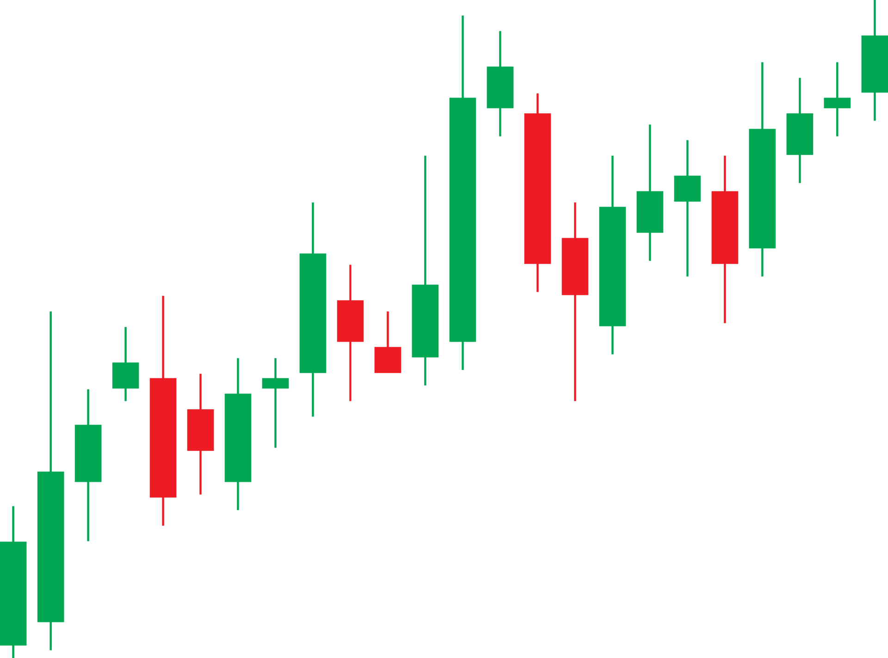
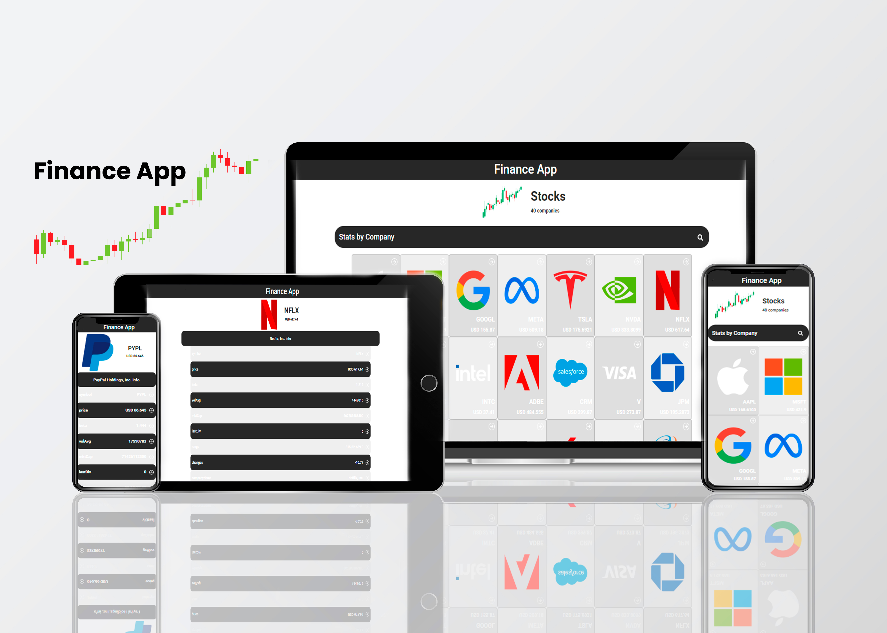

<a name="readme-top"></a>

<div align="center">
    
    <h1><b>Finance App</b></h1>
</div>


---

<!-- TABLE OF CONTENTS -->

# 📗 Table of Contents

- [📖 About the Project](#about-project)
  - [🛠 Built With](#built-with)
    - [Tech Stack](#tech-stack)
    - [Key Features](#key-features)
  - [🚀 Live Demo](#live-demo)
- [💻 Getting Started](#getting-started)
  - [Setup](#setup)
  - [Prerequisites](#prerequisites)
  - [Install](#install)
  - [Usage](#usage)
  - [Run tests](#run-tests)
  - [Deployment](#deployment)
- [👥 Authors](#authors)
- [🔭 Future Features](#future-features)
- [🤝 Contributing](#contributing)
- [⭐️ Show your support](#support)
- [🙏 Acknowledgements](#acknowledgements)
- [📝 License](#license)

---

<!-- PROJECT DESCRIPTION -->

# 📖 Finance App <a name="about-project"></a>

- Application that provides comprehensive data on market-leading companies, including financial metrics and market capitalization.
  Access companies profile (Price, Beta, Volume Average, Market Capitalization, Last Dividend, 52 week range, stock price change, stock price change in percentage, Company Name, Sector, website and image link).

---

#### Learning objectives

- Follow a designated [design](<https://www.behance.net/gallery/31579789/Ballhead-App-(Free-PSDs)>).
- Use React documentation.
- Use React components.
- Use React props.
- Use React Router.
- Connect React and Redux.
- Handle events in a React app.
- Write integration tests with a React testing library.
- Use styles in a React app.
- Use React life cycle methods.
- Apply React best practices and language style guides in code.
- Use store, actions and reducers in React.

## 🛠 Built With <a name="built-with"></a>

### Tech Stack <a name="tech-stack"></a>

  <ul>
    <li>
      
      <a href="https://redux.js.org/">Redux</a>
    </li>
    <li>
      
      <a href="https://react.dev/">React.js</a>
    </li>
    <li>
      
      <a href="https://developer.mozilla.org/en-US/docs/Web/JavaScript">JavaScript</a>
    </li>
    <li>
      
      <a href="https://jestjs.io/">Jest</a>
    </li>
    <li>
      
      <a href="https://sass-lang.com/">SASS</a>
    </li>
    <li>
      
      <a href="https://react-bootstrap.netlify.app/">React-Bootstrap</a>
    </li>
    <li>
      
      <a href="https://developer.mozilla.org/en-US/docs/Web/HTML">HTML</a>
    </li>
  </ul>

---

<!-- Features -->

### Key Features <a name="key-features"></a>

- **Use of Hooks**
- **Use of State**
- **Use of Redux Toolkit**
- **Use of React Router**
- **Use of React Bootstrap**

<p align="right">(<a href="#readme-top">back to top</a>)</p>

---

<!-- LIVE DEMO -->

## 🚀 Live Demo <a name="live-demo"></a>

- [Finance - Live Demo Link](https://finance-nuqi3fq7d-maximoortellis-projects.vercel.app/)

---

<!-- GETTING STARTED -->

## 💻 Getting Started <a name="getting-started"></a>

To get a local copy up and running, follow these steps.

### Prerequisites

In order to run this project you need:

### Setup

Clone this repository to your desired folder:

Example commands:

- With SSH:

```bash
  cd my-folder
  git clone https://github.com/maximoortelli/Finance-App.git
```

- With HTTPS:

```bash
  cd my-folder
  git clone https://github.com/maximoortelli/Finance-App.git
```

- With GitHub CLI:

```bash
  cd my-folder
  gh repo clone maximoortelli/finance-metrics-web-app
```

### Install

Install this project's dependencies with:

- npm install

### Usage

To run the project, execute the following command:

```bash
 npm start
```

Runs the app in the development mode.\
Open [http://localhost:3000](http://localhost:3000) to view it in your browser.

The page will reload when you make changes.\
You may also see any lint errors in the console.

### Run tests

```bash
 npm test
```

Launches the test runner in the interactive watch mode.\
See the section about [running tests](https://facebook.github.io/create-react-app/docs/running-tests) for more information.

<p align="right">(<a href="#readme-top">back to top</a>)</p>

---

<!-- AUTHORS -->

## 👥 Authors <a name="authors"></a>

👤 **Arthur ITurres**

- GitHub: [@Maximo Ortelli](https://github.com/maximoortelli)
- LinkedIn: [Maximo Ortelli](https://www.linkedin.com/in/maximo-ortelli-rueda/)

<p align="right">(<a href="#readme-top">back to top</a>)</p>

---

<!-- FUTURE FEATURES -->

## 🔭 Future Features <a name="future-features"></a>

- [x] Select the API.
- [x] Build files structure for React app.
- [x] Prepare routes and navigation in app.
- [x] Make sure that a user can display a list of items and filter them.
- [x] Create the tests for the application.
- [x] Style components to match the design provided.
- [x] Deploy the project and test for final details.
- [x] Record a video for your project.
- [x] Enhance Desktop UI/UX.

<p align="right">(<a href="#readme-top">back to top</a>)</p>

---

<!-- CONTRIBUTING -->

## 🤝 Contributing <a name="contributing"></a>

Contributions, issues, and feature requests are welcome!

Feel free to check the [issues page](https://github.com/maximoortelli/Finance-App/issues).

<p align="right">(<a href="#readme-top">back to top</a>)</p>

---

<!-- SUPPORT -->

## ⭐️ Show your support <a name="support"></a>

Give a ⭐ if you liked this project!

<p align="right">(<a href="#readme-top">back to top</a>)</p>

---

<!-- ACKNOWLEDGEMENTS -->

## 🙏 Acknowledgments <a name="acknowledgements"></a>

I thank the Code Reviewers for their advice and time 🏆

Original [design](<https://www.behance.net/gallery/31579789/Ballhead-App-(Free-PSDs)>) idea by [Nelson Sakwa on Behance](https://www.behance.net/sakwadesignstudio).

<p align="right">(<a href="#readme-top">back to top</a>)</p>

---

<!-- LICENSE -->

## 📝 License <a name="license"></a>

This project is [MIT](./LICENSE) licensed.

<p align="right">(<a href="#readme-top">back to top</a>)</p>

---
